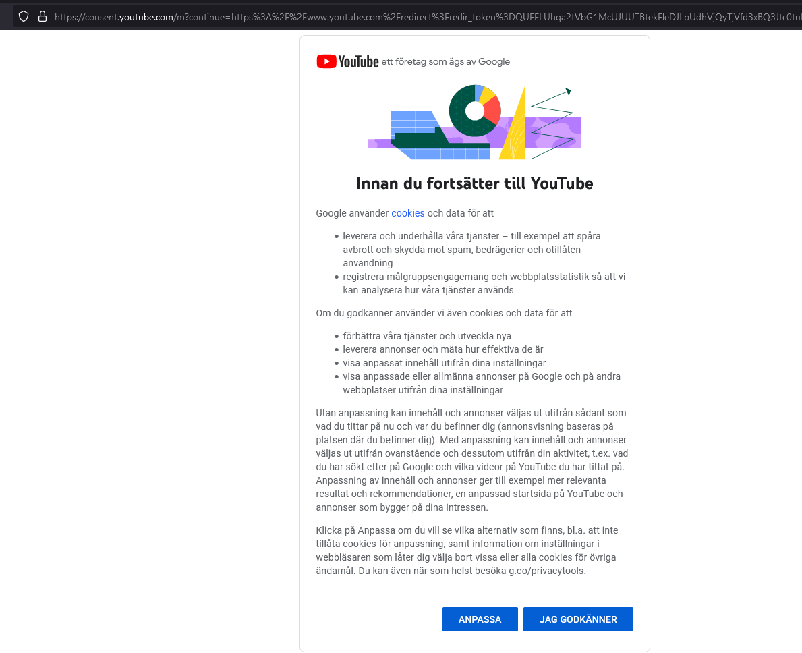

# Steam Community Link Filter bypass by utilizing a Google Service Open Redirect vulnerability.
As you may know, when you add a link to your steam profile, it usually shows the domain, so it looks like "test [snapchat.com]"  
This might be annoying for people who wish to put links in a sentence, and it not showing up right after.  
Now this might seem impossible to do, as they patched most of the redirect links, such as youtube.com/redirect and google's redirect.  
But don't fret! As youtube recently implemented a new "consent" page, for their new ToS or something, this brings another "exploit" to existance.  

By going to any youtube link, you may get a popup that looks like this  
  
If you press the button where you agree, you get redirected to the actual youtube link. But as you noticed, theres the actual full URL in the link, which can be editable!  
Yes thats right, as long as you have "&gl=SE&m=0&pc=yt&uxe=23983172&hl=sv&src=1" (or whatever you had at the end of the link), it will not error if you were to modify it!

So what can you do with this?  
Redirect it to any page of course, as long as they agree to the ToS!

# Steps to make it work
Go to any youtube video, grab a redir_token from the uploader's link in the description (if they have one)  
Get a consent link, modify it to look like this  
https://consent.youtube.com/m?continue=https%3A%2F%2Fwww.youtube.com%2Fredirect%3Fredir_token%3D_put_redirect_token_here_%26q%3D_link_here_%2F_anything_after_the_link_here_%2F&gl=SE&m=0&pc=yt&uxe=23983172&hl=sv&src=1  
Change the "_put_redirect_token_here_ and _link_here_ and _anything_after_the_link_here_"   
The link above would redirect to https://www.youtube.com/redirect?redir_token=_put_redirect_token_here_&q=_link_here_/_anything_after_the_link_here_/ upon agreeing to the ToS   
An example of this with proper token and link would look like this:
https://consent.youtube.com/m?continue=https%3A%2F%2Fwww.youtube.com%2Fredirect%3Fredir_token%3DQUFFLUhqa2tVbG1McUJUUTBtekFleDJLbUdhVjQyTjVfd3xBQ3Jtc0tuMlVudXpiWVRzeTdhUnZrdjByVzBZMHJ1d25yRDBDQmNjRXA1UmtXUnd0WEVONHZNWE9xT2FpOHU1ZDZqY0cxMjZETXRHb29ZV3RqTXRIUGRkbjdia2E2eW00SWVxSWtCLWZSazdENjJBeTJkaE1qcw%26q%3Dgithub.com%2Fabbe%2F&gl=SE&m=0&pc=yt&uxe=23983172&hl=sv&src=1  
This redirects to my Github page.

# Results

